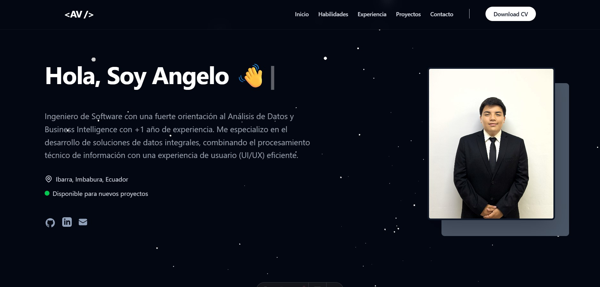

# 🚀 Portafolio Profesional - Angelo Vaca

> Ingeniero de Software & Analista de Datos

Este es el repositorio del código fuente de mi portafolio profesional. Un sitio web estático de alto rendimiento diseñado para mostrar mis proyectos, habilidades y experiencia en el mundo del análisis de datos y el desarrollo de software.

🔗 **Demo en vivo:** [https://portafolio-angelo.vercel.app/](https://portafolio-angelo.vercel.app/)

---

## 🛠️ Tecnologías (Tech Stack)

Este proyecto fue construido utilizando una arquitectura moderna basada en componentes y **Headless CMS**:

* **Framework:** [Astro 5.0](https://astro.build/) (Enfoque "Islands Architecture" para máximo rendimiento).
* **Lenguajes:** TypeScript, JavaScript.
* **Estilos:** [Tailwind CSS](https://tailwindcss.com/) (Diseño responsivo y moderno).
* **CMS (Gestor de Contenido):** [Storyblok](https://www.storyblok.com/) (Gestión dinámica de proyectos y textos).
* **Interactividad:** React + OGL/Three.js (Shaders personalizados para efectos visuales de fondo).
* **Despliegue:** [Vercel](https://vercel.com/) (CI/CD automático con Webhooks).

## ✨ Características Principales

* **⚡ Rendimiento Extremo:** Generación de Sitio Estático (SSG) con Astro.
* **🎨 Animaciones 3D:** Uso de shaders (GLSL) para fondos interactivos (Rayos de luz / Fluidos).
* **📱 Diseño Responsivo:** Adaptado perfectamente a móviles, tablets y escritorio.
* **📂 Gestión de Contenido:** Todos los textos, proyectos e imágenes se administran desde Storyblok sin tocar código.
* **🔍 SEO Optimizado:** Metadatos dinámicos, Open Graph y accesibilidad.
* **📥 Recursos:** Descarga directa de CV y enlaces a redes profesionales.

## 🚀 Instalación y Ejecución Local

Si deseas correr este proyecto en tu máquina local:

1.  **Clonar el repositorio:**
    ```bash
    git clone [https://github.com/TU_USUARIO/PORTAFOLIO-ANGELO.git](https://github.com/TU_USUARIO/PORTAFOLIO-ANGELO.git)
    cd PORTAFOLIO-ANGELO
    ```

2.  **Instalar dependencias:**
    ```bash
    pnpm install
    # o si usas npm: npm install
    ```

3.  **Configurar Variables de Entorno:**
    Crea un archivo `.env` en la raíz del proyecto y agrega tu token de Storyblok:
    ```env
    STORYBLOK_TOKEN=tu_token_aqui
    ```

4.  **Iniciar el servidor de desarrollo:**
    ```bash
    pnpm dev
    ```
    Visita `http://localhost:4321` en tu navegador.

## 📂 Estructura del Proyecto

```text
/
├── public/             # Assets estáticos (CV, Favicon, Social Preview)
├── src/
│   ├── components/     # Componentes UI (Navbar, Cards, etc.)
│   │   └── Islas/      # Componentes interactivos (React/3D)
│   ├── layouts/        # Plantilla principal HTML/SEO
│   ├── pages/          # Rutas y páginas de Astro
│   └── storyblok/      # Componentes vinculados al CMS
└── astro.config.mjs    # Configuración del framework